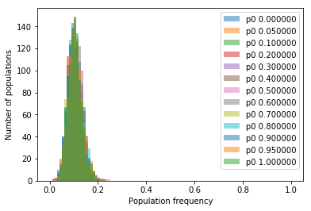

# The Wright Fisher Model
The aim of the study was to study the evolution of allele frequencies in a finite population. This notebook describes a very
basic model which assumes:
* Population size:    constant, N

* Structure of the genome:   one single haploid chromosome of length 1 base pair. 

* Mode of reproduction:      asexual

* Mutation process:          No mutation

* Transmission:              Asexual transmission (clonal reproduction)

Below are the figures that were generated.
## Probability distribution of alternate alleles
Number of populations (samples drawn) = 1000 
__Population size = 50__ 
 
__Population size = 100__  
 
## Mean frequency of alternate allele across 100 generations 
The graph below displays the mean allelic frequencies for 100 generations (plus the initial population). 
 
## Population frequency of 1 allele across 30 generations
Number of populations = 10 Population size of one generation = 100 Intial p0 = 0.3 
 
Number of populations = 1000 Population size of one generation = 100 Intial p0 = 0.3 
 
## Plots for allele frequency across 1000 populations for 30 generations
### Line Plot
 
### Density Map
 
### 3-D Histogram
 
## Effect of population size on distribution of allele frequencies
 
### Relation between expected changes in allele frequencies (variance) and population size
The allele counts of a particular generation follow
binomial distribution (for large populations poisson). The variance is given by N*p*(p-1), where N is the size of 
the population and p is frequency of alternate allele in the current population.
p equals p0 for the current population and is a constant. Hence,
the relation between population size and variance is linear. 
 
## Effect of initial allele frequency on distribution of allele frequencies
 
### Relation between expected changes in allele frequencies (variance) and initial allele frequency
Again if we consider the relation of Var=N*p*(p-1), we get a quadratic equation. And, in fact the data supports this theory.
Also, its simpler than any trignometric function! 
 
## Mutations
### Line Plot for allelic frequencies across 100 generations
Number of populations = 2000  
Number of generations = 100  
Size of each population = 10  
Mutations introduced initially = 1/10  
 
### Generation vs fixation probability
